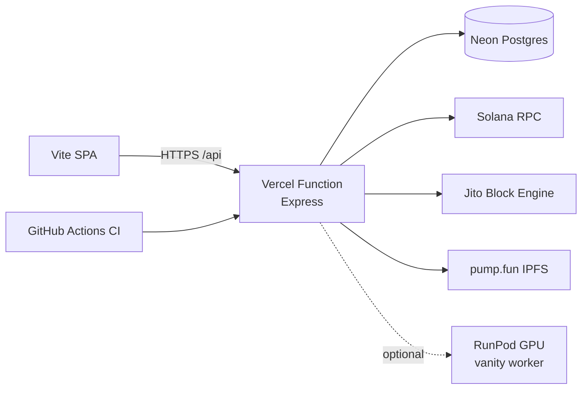

# pump.fun Token Launcher

Full-stack Solana token launcher for [pump.fun](https://pump.fun): authenticated multi-user wallets, create+buy (Jito / RPC), trading, creator earnings, and optional GPU vanity mint grinding on RunPod.

[](https://github.com/bavtika/pumpfun-launcher/actions/workflows/ci.yml)



## Stack

- **client/** — React 19, TypeScript, Vite 8, Tailwind CSS v4, Zustand
- **server/** — Express, TypeScript, `@pump-fun/pump-sdk`, Neon serverless driver
- **api/** — Vercel serverless entry (same Express app)
- **runpod-worker/** — Docker image for OpenCL vanity address jobs
- npm workspaces · Node 22

## Quick start (local)

```bash
npm install
cp .env.example .env   # fill SITE_PASSWORD, WALLET_ENCRYPTION_KEY, DATABASE_URL, RPC_URL
npm run dev
```

| Service | URL |
| --- | --- |
| Client (Vite) | http://localhost:5173 |
| API | http://localhost:3000 |

First visit: **Register** with username, password, and the shared `SITE_PASSWORD`.

### Scripts

| Command | Purpose |
| --- | --- |
| `npm run dev` | API + client with proxy |
| `npm run build` | Typecheck/build server + client |
| `npm run ci` | Same as CI build |
| `npm run test:smoke` | HTTP smoke against a running local API (needs `.env`) |

## Environment

| Variable | Required | Purpose |
| --- | --- | --- |
| `SITE_PASSWORD` | yes | Shared gate on login/register |
| `WALLET_ENCRYPTION_KEY` | yes | Encrypts wallet secrets in DB (64 hex **or** passphrase ≥16 chars) |
| `DATABASE_URL` | yes | Postgres (Neon / Vercel Postgres) |
| `RPC_URL` | yes | Solana JSON-RPC |
| `PORT` | no | Local API port (default `3000`) |
| `RUNPOD_ENDPOINT_ID` / `RUNPOD_API_KEY` | no | GPU vanity endpoint |

Never commit `.env` or `.wallets.json`.

## Production deploy (Vercel + Neon)

1. Push `main` to GitHub (this repo).
2. Create a Neon (or Vercel Postgres) database → copy `DATABASE_URL`.
3. Import the project in [Vercel](https://vercel.com). Root = repository root. `vercel.json` sets install/build/output and `/api/*` rewrite.
4. Set Production (+ Preview) env: `SITE_PASSWORD`, `WALLET_ENCRYPTION_KEY`, `DATABASE_URL`, `RPC_URL` (+ RunPod if used).
5. Deploy. Tables are created on first authenticated request.
6. CI: `.github/workflows/ci.yml` builds on every push/PR. CD: Vercel Git integration.

### RunPod vanity worker (optional)

See [`runpod-worker/README.md`](./runpod-worker/README.md) for Docker build, endpoint settings, and the job API contract. Vanity jobs are bound to the authenticated user in Postgres (no cross-user status polling).

## Layout

```
├── api/index.ts              # Vercel → Express
├── client/                   # SPA + client/api (NFT tracing anchors)
├── server/src/
│   ├── lib/                  # auth, db, crypto, Solana helpers
│   ├── routes/               # auth, wallets, deploy, trade, vamp, vanity, earnings
│   └── services/             # deploy, jito, ipfs, trade, …
├── runpod-worker/            # GPU vanity Dockerfile + handler
├── scripts/                  # vercel SPA sync + local smoke
├── vercel.json
└── .github/workflows/ci.yml
```

## Security notes (portfolio / ops)

- Site is not public without `SITE_PASSWORD`; sessions are cookie-based.
- Wallet private keys are encrypted before storage; decryption only for signing.
- Deploy never falls back to a shared `DEPLOYER_PRIVKEY` — each user must own a wallet.
- Vanity job IDs are scoped per user; RunPod outputs mint keypairs (no funds) — see worker README.

## License

MIT — see [LICENSE](./LICENSE).
